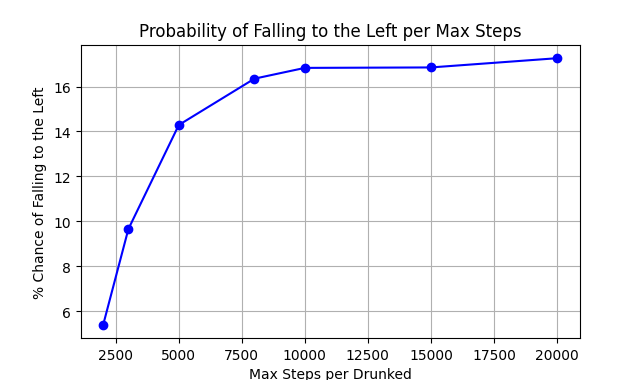

# The drunk guy on a bride problem

Matthieu Hanania

## The problem
A drunk guy is on the 17th meter of a 100m bridge, every step he has a 1/2 probability of going left, and 1/2 of going right. If he reaches 0m or 100m he falls off the bridge and dies.

## Questions
1) What's the probability of him reaching 100m and falling?
2) How long will it take him to fall off the bridge, on average? 

## Simulation

To respond the question, we process to experimental simulation of 100.000 drunked with 2.000, 3.000, 5.000, 8.000,10.000 and 20.000 max steps per person.
The greater the maximum number of steps is, the number of survivors will be important and so the probability of reaching 100m and falling.

### Results
| max steps per drunked | % of falling at left (0 meters) | % of falling at right (100 meters) | sum of falling percents | time (s) | mean steps to fall | ± % of uncertainty  |
|-----------------------|---------------------------------|------------------------------------|------------------|----------|-------|-------|
| 2000                  | 5.4                             | 70.53                              | 75.93            | 45.5     |966    |0.96   |
| 3000                  | 9.66                            | 75.73                              | 85.4             | 56.9     |1253   |1.43   |
| 5000                  | 14.29                           | 80.33                              | 94.62            | 63.6     |1665   | 2.27  |
| 8000                  | 16.35                           | 82.36                              | 98.71            | 67.4     |1970   |  3.24 |
| 10000                 | 16.83                           | 82.69                              | 99.52            | 70.7     |2068   |  3.62 |
| 15000                 | 16.85                           | 83.15                              | 99.95            | 66.9     |2128   |  4.06 |
| 20000                 | 17.26                           | 82.74                              | 100.00           | 69.6     |2136   | 4.12  |

For repondong to the questions, we take our results of the 20.000 steps simulation
1) The probability of falling at 100m is 17.26%
2) With a maximal number of steps per drunks, the average number of steps leading to the fall is 2136 steps

### Graphical representation

## Mathematical approach

